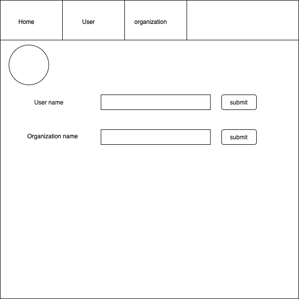
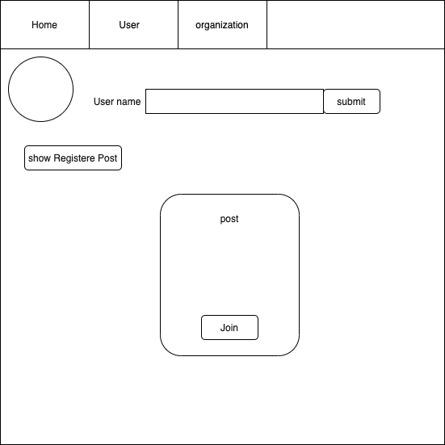
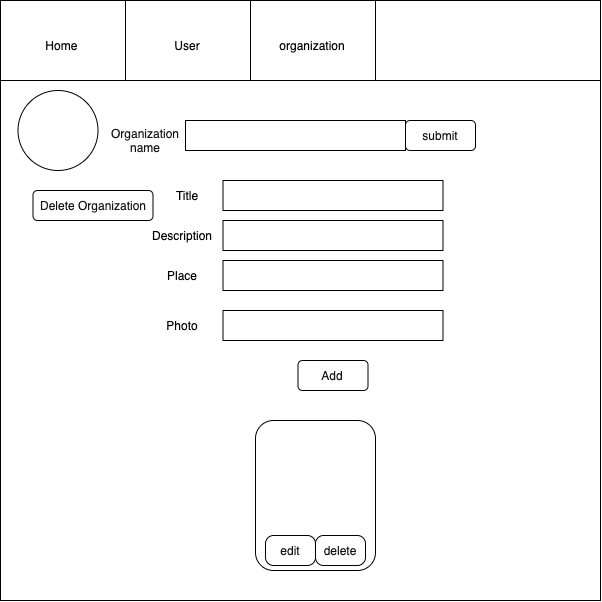
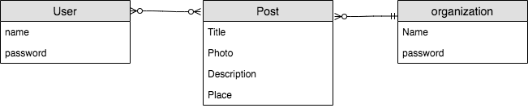

# Project-3-Full-Stack-Application
## Table of Contents
* [Overview](#overview)
* [The Wireframe](#the-wireframe)
* [ER Diagram](#er-diagram)
* [List of technologies ](#list-of-technologies )
* [User Stories](#user-stories)
* [The plan](#the-plan)
* [Resources](#resources)
* [Future plans](#future-plans)
* [Contact](#contact)

​
## Overview:
##### Live Application URL [GitHub Pages](https:)
##### The idea of website :
 Is provided services to both organization and user .In the general the website allow to organizations to publish the post about a volunteer work and allow to user to register in it .
###### In the words of ~Albert Schweitzer:
> “Wherever you turn, you can find someone who needs you. Even if it is a little thing, do something for which there is no pay but the privilege of doing it. Remember, you don’t live in the world all of your own.” 
#### The Wireframe :

#### ER Diagram :

#### List of technologies :
- React 
- Express
- MongoDB
- Mongoose
- Node
- NPM
- VS code
- JSX
- bcrypt
- jsonwebtoken
- Postman

#### User Stories :
##### For User :
- **As  an user** , I should  be able to register.
- **As  an user**, I should  be able to login.
- **As  an user** ,I should  be able to remove my name .
- **As  an user** ,I should  be able to show the posts that I have registered at it .
- **As  an user** ,I should  be able to see the all posts publish .
- **As  an user**,I should  be able to join to a new post .
- **As  an user**,I should  be able to leave post was registered before .
- **As  an user**,I should  be able to logout .

##### For organization :
- **As an organization** ,I should  be able to register.
- **As an organization** ,I should  be able to login.
- **As an organization** ,I should  be able to remove my name .
- **As an organization** ,I should  be able to show  all the posts that I have published .
- **As an organization** ,I should  be able to add a new post .
- **As an organization** ,I should  be able to  edit any post .
- **As an organization** ,I should  be able to  delete any post .
- **As an organization** ,I should  be able to logout .

### The plan :
#####  Team Development Plan :
1. **The Goals :** Create a website without error both logical ,and technology.
2. **Objective :** First , done all the basic requirement of project, and then add more features .
3. **Resources required :** Keep on training.
4. **Measurement :** Successful .
5. **Deadline :** One week .
#####  strategy :
* First,search about ideas and choose the one that all members accept it.
* Draw the initial wireframe to figure out the requirement .
* Collection data .
* Work in a sequence steps for both frontend and backend .
* Use tool **trello** to divide the tasks and follow others work.
* Test our works by using **Postman** tool before push work.

#### Resources :
- **[React.js](https://reactjs.org/)**
- **[React Deployment Guide](https://github.com/gitname/react-gh-pages)**
- **[Git Team Workflow](https://www.atlassian.com/git/tutorials/comparing-workflows)**
- **[Trello](https://trello.com/)**
- **[mongoose](https://mongoosejs.com/)**
- **[ReactRouterWebsite](https://reacttraining.com/react-router/web/guides/quick-start)**
- **[express](https://expressjs.com/)**

#### future plans :
* Improve design .
* More interactive .
* Add more features .

## Contact :
Created by 
- Faisal Aljazaeri - aljazaeri.faisal@gmail.com
- Haya Abdulaziz  -  Hayal5066@gmail.com
- Ranen Khlabi Ranen - Alkhlabi@hotmail.com
- Wojdan Alrasheedi - wejdansaud58@hotmail.com

Feel free to contact us :* !

 